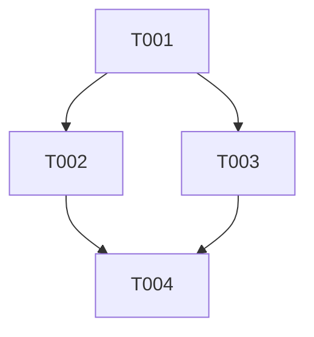

# Ticket repo layout

Default root: `~/peng-tickets`.

```
<ticket-repo>/
  config.yml
  projects/
    <project-slug>/
      PROJECT.md
      tickets/
        T001-<kebab-slug>.md
        T002-<kebab-slug>.md
```

IDs are `T` + zero-padded 3 digits, unique inside the project. Never reuse an ID.

## `config.yml`

```yaml
ticket_repo: ~/peng-tickets
default_retry_limit: 3
default_project: null
```

`ticketmaster/config.yml` in `peng-skills` may override `ticket_repo` for this machine.

## `PROJECT.md`

```markdown
---
slug: checkout-api
code_repo: ~/Projects/checkout
status: planning          # planning | looping | done | stuck
---

# checkout-api

## Outcome
<one paragraph the user signed off on>

## DAG

```

`A --> B` means A blocks B (`B.blocked_by` contains A).

## Ticket file

`projects/<slug>/tickets/T001-add-cart-port.md`

```markdown
---
id: T001
title: Add CartPort interface
status: open              # open | ready | in-progress | done | failed
blocked_by: []            # ticket ids that must be done first
blocks: [T002]            # denormalized; keep in sync with dependents' blocked_by
retry_limit: 3
retries: 0
validation: ""            # empty, or a shell command, or a multiline script
code_repo: ~/Projects/checkout
created: 2026-08-14
updated: 2026-08-14
---

# T001 — Add CartPort interface

## Goal
<one sentence>

## Plan
<files to create/modify, interfaces produced/consumed — Superpowers writing-plans style>

## Validation
<repeat the validation command or "none — use verification-before-completion">

## Log
```

### Status machine

- `open` / `ready` — not started, eligible once blockers are `done`
- `in-progress` — an agent is working it
- `done` — validation passed (or empty validation + evidence)
- `failed` — validation failed `retry_limit` times; does **not** unblock others

Treat `open` and `ready` the same for scheduling. Set `ready` when you want to mark "unblocked now."

### Edges

Only `blocked_by` is authoritative. After any edit, rewrite each ticket's `blocks` to match, and refresh the mermaid in `PROJECT.md`.

A ticket is **unblocked** iff every id in `blocked_by` has `status: done`.

Cycles are invalid.
